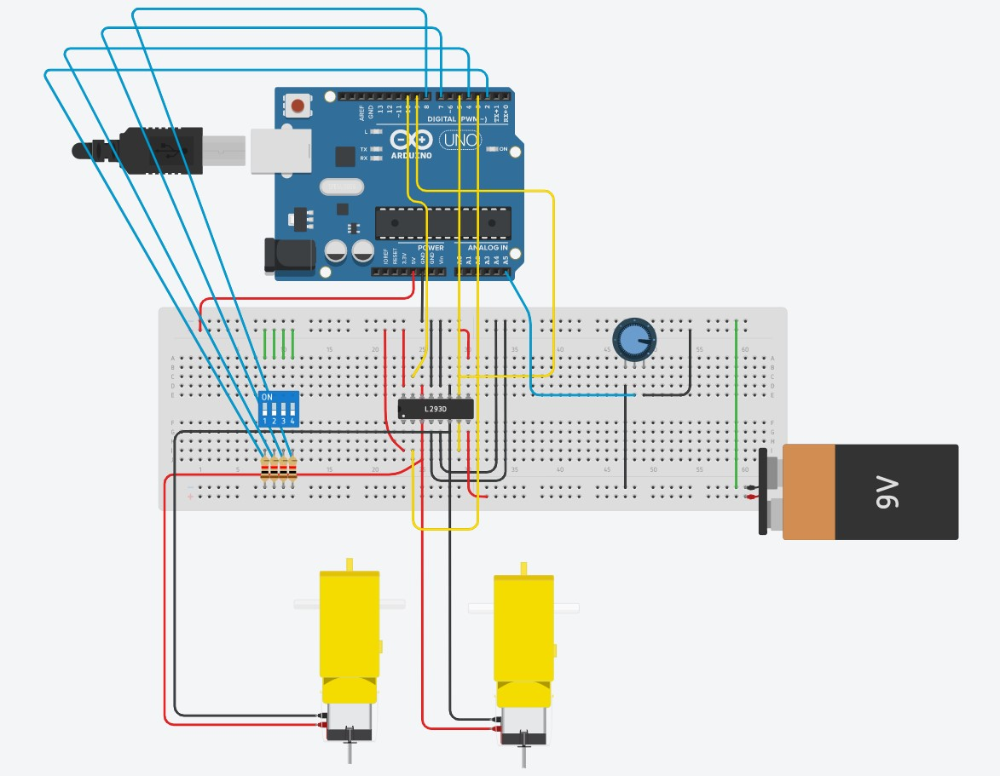

# Project Overview: # 

For this task, I was assigned to wire two motors controlled by a dip switch. I used arduino to control the inputs and the outputs for the motor and an potentiometer to control the speed of the motor.

 
 

## Project Hardware And Wiring: ##

 

 
 

## Link To Tinkercad Project And Github Repository: ##

>[Tinkercad R3 Software Training Package](https://www.tinkercad.com/things/fL9dq7z8zX8 "Name : Yadu Krishnan Madhu")

 
 

 ## Contact Information: ##
 

>Name: Yadu Krishnan Madhu  
>Email: ymadhu@ryerson.ca  